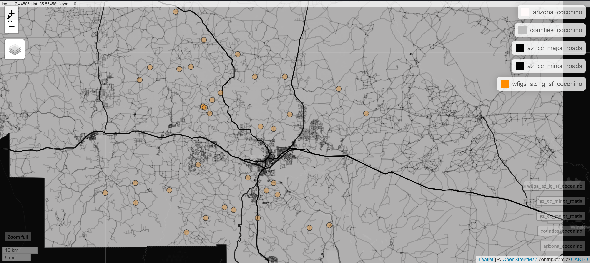

# Possible Topic

I grew up in Flagstaff, AZ, a densely forested part of the state. In general, life in Flagstaff is fairly worry-free, aside from the ever-present threat of wildfires in the area. Being curious about what kind of wildfire data was available turned out to be fruitful for geostatistical data.

Based on what we have learned in this course so far, I believe there is quite a bit of opportunity for spatial statistical analyses that could be applied to spatial wildfire data. One of my inspirations is an intuition that I have from growing up that if a fire were to start in a certain part of the forest that it was more likely to get out of control due to accessibility.

A possible topic may be to approach modeling of the size of wildfires based on proximity to accessible roads, fire stations, and the season which they happen, among other factors. In a general sense, we could be tackling the question of whether there is any spatial dependence for the size of a wildfire, and can we make a prediction model for the size of a fire if it were to start at a particular location? Or, can we use point processes to come up with a intensity surface model for large wildfires spatially? In a real-world sense, this might be useful for identifying areas that may need better access, or for prioritizing priority areas for prevention needs like control burns.

Of course, this analysis could get very heavy (as I am sure it has by professionals), but there could be some novel insights that could be captured within the bounds of the class project.

# Identify a potential dataset to work with

I wanted to find a wildfire data set that captures the locations of where fires start spatially on earth, as well as the total acreage of the resulting fire to do the analysis I was generally considering.

## Description of Dataset

 In my search, I managed to find a Wildland Fire Incident Location data set, hosted via ArcGIS Open data, through the National Interagency Fire Center website.

https://data-nifc.opendata.arcgis.com/datasets/b4402f7887ca4ea9a6189443f220ef28_0/explore?location=-0.000000%2C0.000000%2C1.38

This data set contains all wildfire data in the continental US reported to the IRWIN system. It contains a wealth of geostatistical data including spatial coordinates of fire origin, dates and times of incidence, total acreage of the fire, among many other factors that may be of interest. 

Wildfire incidence data fits the mold of geostatistical data, and on its own can be cut in many interesting ways. But, I also believe it has potential to be combined with other data sets to approach some questions that I have some intuition about.

For the exploration I also used the `rFIA` package (thanks for the inspiration, Dani!) to capture abundance data that may be useful for the project. Additionally, data like roads may help to analyze how certain fires end up getting out of control/becoming large.

In general, this is a data set that I think leaves the door open for lots of different questions and analyses.


## Exploratory Data Analysis

In this section, I put together some visualizations that were interesting to me and to serve as proof-of-concept for combining some data.

```{r warning=FALSE, message=FALSE}

library(dplyr)
library(readr)
library(tigris)
library(sf)
library(rFIA)
library(openmeteo)
library(gganimate)
library(ggplot2)
library(mapview)
library(tidyverse)
library(leaflet)
library(htmltools)

# load datasets
library(here)
set_here(path='..')

load(here("data/az_fia.RData"))
load(here("data/az_fia_density.RData"))
load(here("./data/az_roads_cc_sf.RData"))
load(here("./data/wfigs_az.RData"))

```


```{r data_cleanup, warning=FALSE, results='hide', cache=TRUE}

# path <- "./wildland_fire_incident_locations/WFIGS_Incident_Locations_-265102656568979733.csv"
# wfigs_incident_location_data <- read_csv(path, show_col_types = FALSE)
# 
# #convert date data to date objects
# 
# wfigs_incident_location_data <- wfigs_incident_location_data %>%
#   mutate_at(vars(FireDiscoveryDateTime, ContainmentDateTime, ControlDateTime, CreatedOnDateTime_dt, ModifiedOnDateTime_dt), as.POSIXlt, format = "%m/%d/%Y %I:%M:%S %p")
# 
# wfigs_incident_location_data <- wfigs_incident_location_data %>%
#   filter(!is.na(InitialLatitude) & !is.na(InitialLongitude))
# 
# wfigs_az <- wfigs_incident_location_data %>% filter(POOState=="US-AZ")
# # wfigs_ca <- wfigs_incident_location_data %>% filter(POOState=="US-CA")
# 
# 
# rm(wfigs_incident_location_data)

```

```{r azdata, message=FALSE, warning=FALSE, results='hide', cache=TRUE}

wfigs_az <- wfigs_az %>% filter(!is.na(IncidentSize))

wfigs_az_sf <- st_as_sf(wfigs_az, coords = c("InitialLongitude", "InitialLatitude"))

arizona_sf <- states() %>% filter_state("arizona")

az_counties_sf <- counties(state = "AZ", cb = TRUE)

# data saved, long load
# az_roads_cc_sf <- roads(state = "AZ", county = "coconino")

st_crs(wfigs_az_sf) <- st_crs(arizona_sf)
st_crs(az_counties_sf) <- st_crs(arizona_sf)
st_crs(az_roads_cc_sf) <- st_crs(arizona_sf)

#there were some coordinates that were reported outside of the state
wfigs_az_sf <- st_intersection(wfigs_az_sf, arizona_sf)

```


```{r fig.align='center', out.width="95%", tidy=TRUE, warning=FALSE, message=FALSE, results='hide', cache=TRUE, tidy.opts=list(width.cutoff=70)}

plot(arizona_sf$geometry, main = "Wildfires in Arizona 2014-2024")
plot(az_counties_sf, add=T)
plot(wfigs_az_sf$geometry, pch = 16, cex = 0.4, col = scales::alpha("darkred", 0.1), add = T)


```

```{r fig.align='center', out.width="95%", tidy=TRUE, warning=FALSE, message=FALSE, results='hide', cache=TRUE, tidy.opts=list(width.cutoff=70)}

# Extract Coconino County
coconino <- az_counties_sf %>% 
  filter(NAME == "Coconino")

# Crop Arizona and counties to the buffered area
arizona_coconino <- st_intersection(arizona_sf, coconino)
counties_coconino <- st_intersection(az_counties_sf, coconino)
wfigs_az_sf_coconino <- st_intersection(wfigs_az_sf, coconino)

az_cc_major_roads <- az_roads_cc_sf %>% 
  filter(MTFCC %in% c("S1100", "S1200"))  # Primary and secondary roads

az_cc_minor_roads <- az_roads_cc_sf %>% 
  filter(MTFCC %in% c("S1400", "S1500"))  # Minor roads


plot(arizona_coconino$geometry, main = "Wildfires in Coconino County 2014-2024")
plot(counties_coconino, add=T)
plot(az_cc_major_roads, add=T)
plot(az_cc_minor_roads, alpha=0.2, add=T)
plot(wfigs_az_sf_coconino$geometry, pch = 16, cex = 0.4, col = scales::alpha("darkred", 0.2), add = T)

# fun interactive version of the map:

# mapview(arizona_coconino, col.regions = "snow") + 
#   mapview(counties_coconino, col.regions = "gray")+ 
#   mapview(az_cc_major_roads, color = "black", alpha = 0.8) + 
#   mapview(az_cc_minor_roads, color = "darkgray", alpha = 0.3) +
#   mapview(wfigs_az_sf_coconino, col. = "darkred", alpha.regions = 0.3)

```

```{r fig.align='center', out.width="80%"}

```

```{r fig.align='center', out.width="95%", tidy=TRUE, warning=FALSE, message=FALSE, results='hide', cache=TRUE, tidy.opts=list(width.cutoff=70)}

wfigs_az_lg_sf <- wfigs_az_sf %>% filter(IncidentSize >= 1000)

plot(arizona_sf$geometry, main = "Large Wildfires (>1000 acres) in Arizona 2014-2024")
plot(az_counties_sf, add=T)
plot(wfigs_az_lg_sf$geometry, pch = 16, cex = 0.5, col = scales::alpha("darkred", 0.3), add = T)


wfigs_az_lg_sf_coconino <- st_intersection(wfigs_az_lg_sf, coconino)

# fun interactive version of the map:

# mapview(arizona_coconino, col.regions = "snow") +
#   mapview(counties_coconino, col.regions = "gray")+
#   mapview(az_cc_major_roads, color = "black", alpha = 0.8) +
#   mapview(az_cc_minor_roads, color = "black", alpha = 0.15) +
#   mapview(wfigs_az_lg_sf_coconino, col. = "darkorange", alpha.regions = 0.3)


```

```{r fig.align='center', out.width="80%"}

```

```{r fia_az_gen, eval=FALSE, warning=FALSE, results='hide', cache=TRUE}

# this chunk is used to generate az_fia_density. it takes a while to load, so
# I just saved the environment object and will load it for the exploration. 

# # Create square grid
# az_grid <- st_make_grid(arizona_sf, cellsize = 0.5, square = TRUE)
# 
# # Convert to sf object and add grid ID
# az_grid_sf <- st_sf(az_grid) %>% mutate(grid_id = 1:length(lengths(az_grid)))
# 
# # Clip grid to Arizona boundary
# az_grid_clipped <- st_intersection(az_grid_sf, arizona_sf)
# az_grid_clipped <- az_grid_clipped %>% rename(geometry = az_grid)
# 
# az_fia_density  <- tpa(az_fia, polys = az_grid_clipped, returnSpatial = TRUE)
# 
# 
# 
# az_fia_density_plot <- plotFIA(az_fia_density, TPA, min.year = 2024)

```

```{r fia_density, fig.align='center', out.width="75%", warning=FALSE}

year_filter <- 2020

# year filtering
az_fia_density_yr <- az_fia_density %>% filter(YEAR == year_filter)
wfigs_az_yr <- wfigs_az_lg_sf %>% filter(year(CreatedOnDateTime_dt)==year_filter)

# take the intersection of the wildfire data and available density data
wfigs_az_yr <- st_intersection(wfigs_az_yr, az_fia_density_yr)


az_fia_density_plot_yr <- plotFIA(az_fia_density_yr, TPA)


coords <- st_coordinates(wfigs_az_yr$geometry)
coords <- as.data.frame(coords)


wf_density_plot <- az_fia_density_plot_yr +
  geom_point(coords, mapping = aes(x = X, y = Y), color = "red", size=0.75)

wf_density_plot

```


```{r weather_az, eval=FALSE,warning=FALSE, results='hide', cache=TRUE}


```

## Overview of the Dataset

For this exploration, I am only looking at Arizona, and more specifically Coconino County in some cases, since that is where home is and I have some familiarity with it.

There are some interesting patterns that seem to generally track with my intuition. One question that was interesting to me before ever looking at the data was whether there was a connection with a fire getting out of control and whether it started somewhere accessible, i.e. near a road of some kind. Having a look at fires that ended up over 1000 acres, it does appear that most start somewhat "off the beaten path", away from major roads and maybe only off of smaller service roads. You can also see some pretty obvious patterns of wildfires that start right next to major roads, particularly some of the interstates, although they seem to get put out before becoming large.

I also imported tree abundance data from the `rFIA` package to look at a possible connection between size, point pattern intensity, or other insights based on tree abundance for certain regions. The data plotted from 2020 shows a proof-of-concept that I am able to get at least some kind of estimate in a grid for approximate abundance. There are further breakdowns of tree types, etc. in the data that may be interesting to study in terms of wildfire prevalence and chance of becoming a large fire.

There are other datasets that I am seeking that I decided not to include here yet since they were more ambitious, and I wanted for our group to come to a consensus before we delve any deeper, but I believe there are lots of interesting approaches to this data other than my initial thoughts that we could explore, especially combining other data sets.


# Possible statistical model/methods

If we use total acreage of fire as a response, we could use a spatial linear model to create a prediction model for wildfire size based on the location it starts, using factors like month of the year, distance from nearest access road or major road, forest abundance, or other data we may find available.

We could also filter the data to large fires and treat incidence as a point process, maybe to fires that end up exceeding 1000 acres, and use predictors like nearest distance to roads, forest density, or other predictors of available data to fit a point process model to model the risk surface for large wildfires across the state. This could be accomplished using a log-linear or logistic model.

# Possible Challenges

There will be some challenges dealing with this data that I have already encountered. First, getting an understanding of all of the available fields in the wildfire incidence data set will be time consuming, since there are 97 variables that are not all populated. Deciding what is useable/important may be tricky.  Additionally, as is often the case with data sets from the "wild", there is a fair amount of data cleanup that has to happen, which was definitely the case here.

The rFIA data is incomplete, and there are certain regions of Arizona that did not have data available. You'll notice, for one, that I had to make a grid to get any kind of resolution on the abundance data to give any better approximations for regions where there were fires.  There were also fire data points that were in the no-data regions, for which I had to remove some wildfire data using `st_intersection`. There may be some challenges getting some reasonable data fits using this data.

I was having a hard time getting historical climate data spatially. For example, if it was particularly windy the day the fire started, it would be worth including in any models we might be interested in fitting.  One of the factors I would like to include is previous annual total precipitation for a region, which I found to be more difficult than anticipated, so I will save for later if we go this route.

Lastly, this is a TON of data, and it's tricky to negotiate how big the files are and how long it takes to load some of this. I managed to save a few environment objects that took a long time to get created as `*.RData` files, but overall there is a lot of data to filter and work with.

Depending on the questions we come up with if we pursue this data, there will certainly be more challenges formatting data, acquiring data, and getting an analysis set up.


```{r eval=FALSE, echo=FALSE}

# options(timeout = 3600)
# az_fia <- getFIA(states = "AZ")

# in case you ever need to make a box around a point:
# point <- st_buffer(wfigs_az_lg_sf$geometry[1], dist = 10000)
# bbox <- st_bbox(point)
# square <- st_as_sfc(bbox)

# tpa_az <- tpa(az_fia)


```


```{r eval=FALSE, echo=FALSE}

library(httr2)

#API Query, maybe revisit later

# original query
# https://services3.arcgis.com/T4QMspbfLg3qTGWY/arcgis/rest/services/WFIGS_Incident_Locations/FeatureServer/0/query?geometry=-114.8,31.3,-109.0,37.0&geometryType=esriGeometryEnvelope&spatialRel=esriSpatialRelIntersects&outFields=*&returnGeometry=true&f=json

library(httr2)

base_url <- "https://services3.arcgis.com/T4QMspbfLg3qTGWY/arcgis/rest/services/WFIGS_Incident_Locations/FeatureServer/0/query"


az_wildfires_request <- request(base_url) %>%
  req_url_query(
    geometry = "-114.8,31.3,-109.0,37.0",
    geometryType="esriGeometryEnvelope",
    spatialRel="esriSpatialRelIntersects",
    outFields="*",
    returnGeometry="true",
    f="json"
  )

az_wildfires_response <- req_perform(az_wildfires_request)
az_wildfires_data <- resp_body_json(az_wildfires_response)


# Extract features from the JSON data
features <- az_wildfires_data$features

# Convert the list of features to a data frame
az_wildfires_df <- do.call(rbind, lapply(features, function(x) {
  # Combine attributes and geometry into a single list
  c(x$attributes, geometry = list(x$geometry))
}))

# Convert to a data frame
az_wildfires_df <- as.data.frame(az_wildfires_df)

# View the first few rows of the dataframe
head(az_wildfires_df)

```