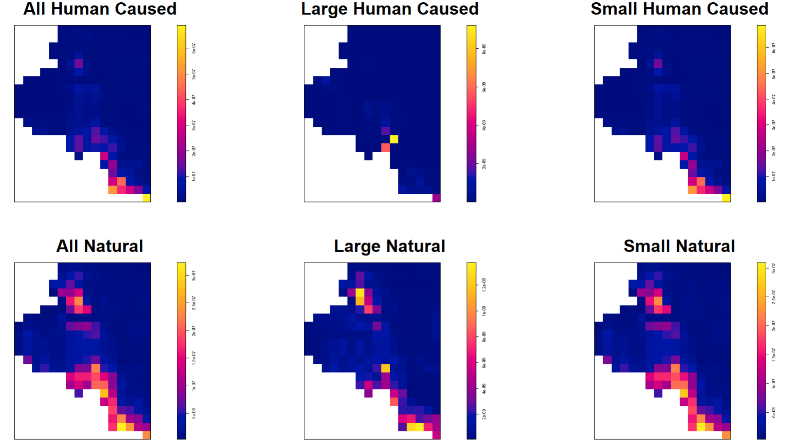

# Log-Gaussian Cox Approach

The first point process approach that we used was a Log-Gaussian Cox Process model. This type of approach is used to determine the intensity surface of the response variable across the domain. For our application, we want to know the intensity of different types of wildfires across the domain of Coconino County. The intensity at a location of $u$ is represented as $\lambda(u)$ where $\lambda(u)\sim N(0,C(\theta))$. There are a few options we could pick from when selecting the covariance structure, but our data indicates that an exponential structure works best where $C(\theta)=C(u,u')=\sigma^2e^{-||u-u'||/h}$.

To fit this model, we need our predictor data to be grids of data points overlaying the entirety of Coconino County that represent the intensity of each predictor. Due to computational limitations, it was only feasible to use a few data points for our prediction surfaces, so each point that we have corresponds to a large amount of land. This means that our predictors are not very granular and therefore the ability to predict the true intensity surface of wildfires will be slightly diminished, but we will still have a working model that will give us insight into wildfire locations.

What we really care about is where future large wildfires might take place. If we have this information, we would be able to give a potential reason for the causes of wildfires and may be able to prevent them from occurring. Considering this, we wanted to look at where large wildfires exist and where small wildfires exist to be able to discern which areas are particularly at risk for large wildfires. This said, we believe that the type of wildfire, be it a natural or human caused one, largely impacts the cause and severity, so we decided to look at those two types of wildfires separately. Also, looking at the big picture, we wanted to see where all wildfires of each type would be occurring, so we looked at all, large and small wildfires for both natural and human caused wildfires, giving us six total response surfaces.

{fig-cap="Wildfire Intensity Surfaces" width=100%} The code for formatting this data and running the models can be seen in Appendix B which yields the plots above. Between natural and human caused, we can see a difference in regions of higher intensity. Natural wildfires occur both in the southern part and the northern part of Coconino County, while human caused is predicted to only really occur in the southern part. Unfortunately, we only have six large human caused wildfires, which means our intensity surface for those fires is uneventful, but form what we can see, it doesn't disagree with where the other sizes of human caused wildfires are. As for distinguishing where large natural wildfires tend to be compared to smaller ones, we don't really see much difference. It just seems that where there are a lot of wildfires, there are more chances for those wildfires to become bigger, so we see larger wildfires in the same areas as smaller wildfires.

Our analysis on our intensity surfaces so far has been assuming that these models reflect our data well, but we should make sure this assumption is valid. For our covariance structure, the model fitting learns two parameters to make these surfaces which were the partial sill $\sigma^2$ and the range $h$. 

|                      |$\sigma^2$(partial sill)|    h(range)|
|:---------------------|-----------------------:|-----------:|
| All Human Caused     | 4.728370e+00           | 7791.704   |
| Large Human Caused   | 3.220770e-09           | 29691.296  |
| Small Human Caused   | 4.688047e+00           | 7806.519   |
| All Natural          | 5.472859e-01           | 9910.462   |
| Large Natural        | 1.400144e+00           | 5681.422   |
| Small Natural        | 2.056924e+00           | 12054.552  |

From the table, we see that the maximum range is just below 30,000, which our units are in meters, so this is about 30km. This value is quite a bit larger than the second highest, but even the value of 30km is completely reasonable for this application. We do have issues with the partial sill parameter being essentially zero for large human caused wildfires, but this is easily explained by the fact that this model was fit to only 6 data points. The rest of the partial sill values are between 0.5 and 5, which are reasonable values to observe. Overall, we don't think that the range and sill parameters that we got from our models are alarming and this indicates that our choices for the model type and covariance structure are likely appropriate for this type of data. This leads us to look at how well our model is explaining our spatial structure.

The location of the wildfires could potentially be just a completely spatially random process that has no design to it, which would indicate that the model fitting approach that we are taking is not appropriate, so we created some envelope graphs to determine if our data points are completely spatially random and if they aren't if our model is doing a good job at prediction.

{fig-cap="Wildfire Intensity Surfaces" width=100%} The top row of these plots uses the $F(u,u')$ function while the bottom row used $G(u,u')$ and the green line represents the intercept only model and the red is our model. If all of these plots had the black lines within the envelope of the green lines, then we wouldn't have any evidence to suggest that our data points were not completely spatially random, but a few of the plots using $F(u,u')$ have their black line outside of the envelope giving us evidence that using modeling to find the intensity surface is a viable approach for this data set. Looking again at the plots using $F(u,u')$, we see that our model predicts the spatial intensity better than the intercept only for every size and type of wildfire, but the opposite is true when we look at $G(u,u')$. This leads us to believe that maybe we are using some predictors that are not important and are lacking some important predictors, such as humidity. After implementing the step function to our models to assess our model using AIC, which took a very long time, we got out the optimal model that strictly uses the intercept. This supports our thought that we should be using different predictors, but we don't believe that we should get rid of all the predictors that we are using. As mentioned previously, the data for this model's predictors were not very granular, which means the distance to roads is not very well captured. We still believe that is useful, but in future, if we use a higher resolution for our plots then some of these predictors may prove to be useful. Accompanying a higher resolution with other data points, we believe we could get a better intensity surface for our data which could give us some meaningful results about the effects of our predictors.
